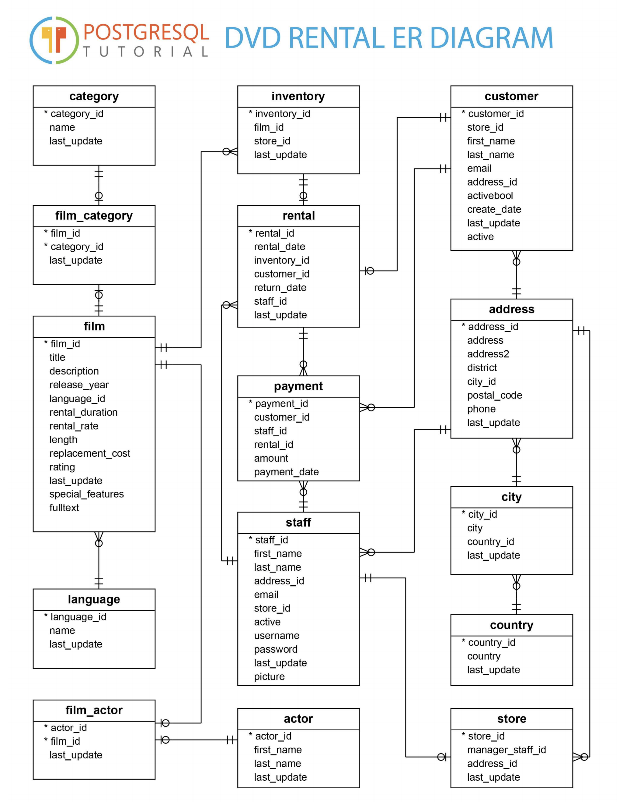
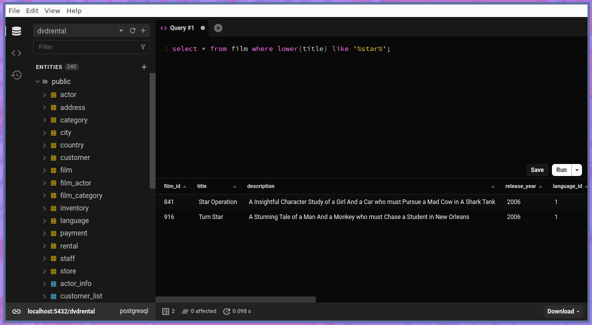

# dvdrental

## About

This is postgres dvd rental database very useful to playing with queries.

**I Do Not Own Anything. All the Rights in This Content Belong to Their Respective Owner's.**

## Links Resource

- [PostgreSQL Tutorial](http://www.postgresqltutorial.com/postgresql-sample-database/)

## PostgreSQL Tutorial ER Diagram



## Running

```sh
# To start the docker image.
make
# To stop the docker image.
make docker_stop
```



## Connect to Database

Credentials:

```
name: dvdrental
user: postgres
password: postgres
port: 5432
```
